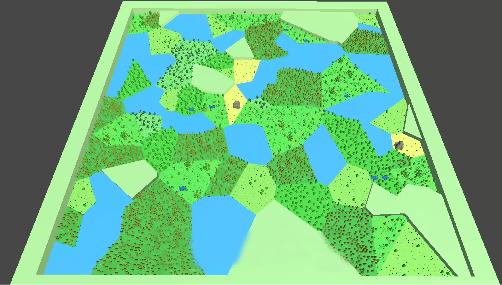

# AI Agent

<figure><figcaption></figcaption></figure>

In **farmstopia + AI**, AI agents are the driving force behind the game world, dynamically generating environments, managing biological behaviors, and interacting with players. By leveraging advanced AI technologies, the game offers an immersive and adaptive experience. Below are the key technologies and methods used to implement these AI agents:

### &#x20;

**1. Behavior Trees** \
Behavior trees are the core tool for AI decision-making, organizing different action nodes in a hierarchical manner. Each node represents a specific action or behavior, such as foraging, resting, or fighting.

**Applications**:

* **Survival Behavior**: When an AI agent detects hunger or fatigue, the behavior tree will decide what to do next, such as finding food, resting, or drinking.
* **Combat and Defense**: The AI can choose different strategies during combat, such as attacking, evading, or setting traps.

**2. Finite State Machines (FSM)** \
A finite state machine is a model used to describe AI behavior through multiple states and transitions. The AI agent switches between predefined states, such as from "rest" to "searching for food."

**Applications**:

* **Dynamic Behavior**: AI agents will shift between different states depending on environmental and internal conditions (e.g., hunger, thirst, fatigue), such as switching from "rest" to "find water."
* **Animal Behavior**: Animal AI switches between "escape" and "attack" states depending on player actions and environmental threats.

**3. Reinforcement Learning (RL)** \
Reinforcement learning is a type of machine learning where AI agents learn optimal behaviors by interacting with the environment and receiving rewards or penalties for their actions.

**Applications**:

* **Resource Management and Decision Making**: AI learns how to manage resources more efficiently, such as deciding when to plant crops, harvest, craft tools, or build structures.
* **Adaptive Behavior**: The AI can optimize its behavior through trial and error, adapting to new challenges and dynamic environments.

**4. Genetic Algorithms (GA)** \
Genetic algorithms mimic the process of biological evolution by using selection, crossover, and mutation to optimize AI behavior. Through this, AI agents improve over time, learning better strategies for survival and interaction.

**Applications**:

* **Personalization of AI**: AI agents can evolve based on player interactions, adjusting to different playstyles and needs for a more personalized experience.
* **Environmental Adaptation**: AI evolves to adapt to varying environments, selecting the most efficient survival strategies through optimization.

**5. Natural Language Processing (NLP)** \
Natural Language Processing allows AI to understand and generate human language, enhancing player interactions with the AI agents.

**Applications**:

* **Dialogue System**: Players can communicate with AI agents through text or voice to exchange resources, ask for help, or receive tasks. NLP enables the AI to understand and respond appropriately.
* **Dynamic Quest Generation**: AI can generate tasks or missions based on player input, such as giving survival tips or asking the player to complete specific challenges.

**6. Neural Networks & Deep Learning** \
Neural networks and deep learning techniques simulate the brain's neural structure, enabling AI agents to recognize patterns, make decisions, and predict future actions.

**Applications**:

* **Behavior Prediction and Planning**: AI agents can predict animal or player behaviors and develop strategies accordingly, optimizing their survival or combat tactics.
* **Resource Allocation**: Deep learning helps AI manage resources, optimizing storage and usage based on patterns and needs.

**7. Multi-Agent Systems (MAS)** \
Multi-agent systems allow multiple AI agents to work independently or collaboratively within the same environment. Each agent has its goals and behaviors, but they can interact, share resources, or compete.

**Applications**:

* **Cooperation and Competition**: AI agents can form teams to defend bases, hunt, or share resources, or they may compete for rare resources.
* **Swarm Behavior**: Animal AI can simulate group behaviors, like pack hunting or flock flying, where agents work together to achieve a goal.

**8. Computer Vision** \
Computer vision enables AI agents to interpret and understand their environment by analyzing images or video, detecting objects, resources, and threats.

**Applications**:

* **Environmental Awareness**: AI agents can visually detect food, water, obstacles, and other key elements in the environment, helping them make decisions.
* **Tracking and Combat**: AI agents use vision processing to lock onto targets, track animals or players, and execute combat strategies effectively.

**9. Procedural Generation** \
Procedural generation algorithms automatically create the game's world, terrain, resources, and tasks, ensuring a unique experience for each playthrough.

**Applications**:

* **World Creation**: The landscape, environment, and resource points are generated dynamically, ensuring that every player's experience is fresh and different.
* **Quest Generation**: AI uses procedural generation to create new quests, ensuring that players face different challenges each time they play.
